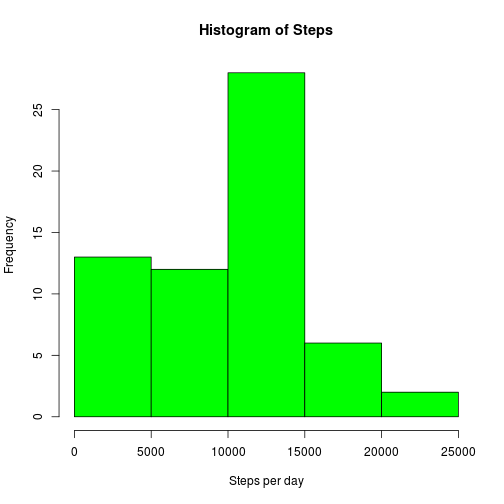
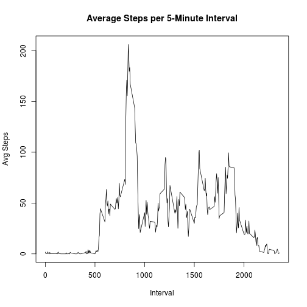
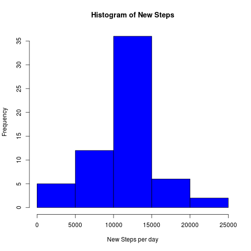
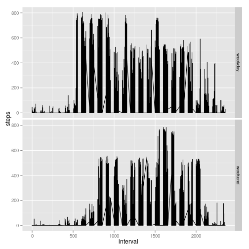

## Assumptions  
It is assumed that the repository has been forked, and the working directory is set.

## Pre-processing  

Unzip the file and read it into a data frame. 


```r
unzip("activity.zip")
activity <- read.csv("activity.csv")
head(activity)
```

```
##   steps       date interval
## 1    NA 2012-10-01        0
## 2    NA 2012-10-01        5
## 3    NA 2012-10-01       10
## 4    NA 2012-10-01       15
## 5    NA 2012-10-01       20
## 6    NA 2012-10-01       25
```

## Problem 1 - What is mean total number of steps taken per day?

*Calculate the total number of steps taken per day, ignoring the missing values:*  


```r
library(dplyr)
dates <- group_by(activity, date)
stepsperday <- summarize(dates, steps=sum(steps, na.rm = TRUE))
stepsperday
```

```
## Source: local data frame [61 x 2]
## 
##          date steps
## 1  2012-10-01     0
## 2  2012-10-02   126
## 3  2012-10-03 11352
## 4  2012-10-04 12116
## 5  2012-10-05 13294
## 6  2012-10-06 15420
## 7  2012-10-07 11015
## 8  2012-10-08     0
## 9  2012-10-09 12811
## 10 2012-10-10  9900
## ..        ...   ...
```

A Histogram is a graphical representation of an estimate of the probability distribution of the data, whereas a barplot displays the categorical counts.

*Make a histogram of the total number of steps taken each day:*  


```r
hist(stepsperday$steps, freq=TRUE, xlab="Steps per day", main="Histogram of Steps", col="green")
```

 

*Calculate and report the mean and median of the total number of steps taken per day:*  


```r
mean(stepsperday$steps)
```

```
## [1] 9354.23
```

```r
median(stepsperday$steps)
```

```
## [1] 10395
```

## Problem 2 - What is the average daily activity pattern?

*Make a time series plot (i.e. type = "l") of the 5-minute interval (x-axis) and the average number of steps taken, averaged across all days (y-axis)*  


```r
intervals <- group_by(activity,interval)
avgstepsperinterval <- summarize(intervals,steps=mean(steps,na.rm=TRUE))
plot(avgstepsperinterval$interval,avgstepsperinterval$steps,type="l",xlab="Interval", ylab="Avg Steps",main="Average Steps per 5-Minute Interval")
```

 

*Which 5-minute interval, on average across all the days in the dataset, contains the maximum number of steps?*  


```r
maxstep <- filter(avgstepsperinterval,steps==max(steps))
select(maxstep,interval)
```

```
## Source: local data frame [1 x 1]
## 
##   interval
## 1      835
```

## Problem 3 - Imputing missing values

*Calculate and report the total number of missing values in the dataset (i.e. the total number of rows with NAs)* 


```r
missingrows <- activity[!complete.cases(activity),]
count(missingrows)
```

```
## Source: local data frame [1 x 1]
## 
##      n
## 1 2304
```

*Create a new dataset that is equal to the original dataset but with the missing data filled in.*  
My strategy is to join the avgstepsperinterval to the activity data frame and populate missing values with the avg steps for that interval.


```r
newactivity <- merge(activity, avgstepsperinterval, by.x="interval", by.y = "interval")
newactivity <- mutate(newactivity, steps = ifelse(is.na(steps.x),steps.y,steps.x))
```

*Make a histogram of the total number of steps taken each day and Calculate and report the mean and median total number of steps taken per day.*  


```r
newdates <- group_by(newactivity, date)
newstepsperday <- summarize(newdates, steps=sum(steps))
hist(newstepsperday$steps, freq=TRUE, xlab="New Steps per day", main="Histogram of New Steps", col="blue")
```

 

```r
mean(newstepsperday$steps)
```

```
## [1] 10766.19
```

```r
median(newstepsperday$steps)
```

```
## [1] 10766.19
```

*Do these values differ from the estimates from the first part of the assignment?*   

Yes, the values are different.  

*What is the impact of imputing missing data on the estimates of the total daily number of steps?* 

The data becomes more like a bell curve when using the average daily steps in place of the NAs. The mean and median are now the same, and those measures of central tendency have a higer value than the original data.

## Problem 4 - Are there differences in activity patterns between weekdays and weekends?

*Create a new factor variable in the dataset with two levels – “weekday” and “weekend” indicating whether a given date is a weekday or weekend day.*  


```r
library(lubridate)
newactivity$date <- ymd(newactivity$date)
newactivity <- mutate(newactivity, daytype = ifelse(weekdays(date) %in% c("Saturday","Sunday"),"weekend","weekday"))
```

*Make a panel plot containing a time series plot (i.e. type = "l") of the 5-minute interval (x-axis) and the average number of steps taken, averaged across all weekday days or weekend days (y-axis).*  


```r
library(ggplot2)
t <- ggplot(newactivity, aes(interval, steps)) + geom_line()
t + facet_grid(daytype ~ .)
```

 
